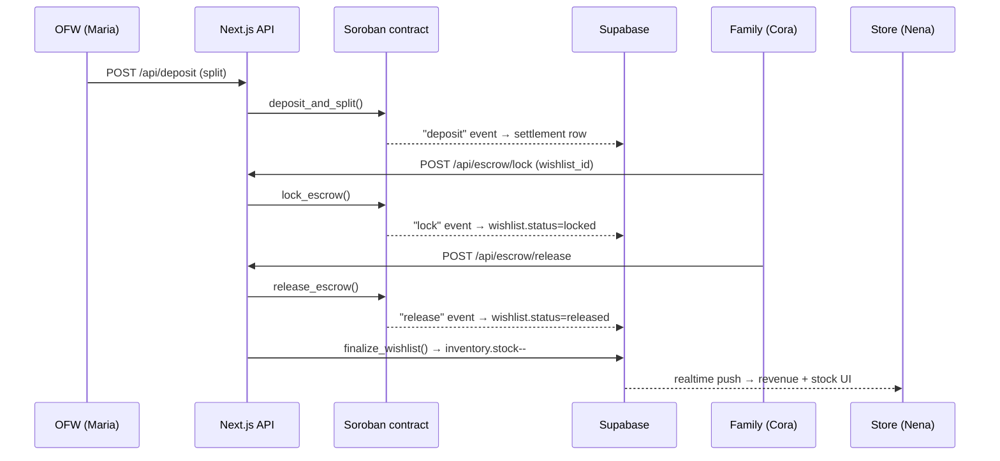

# InternStellar — Pitch Deck (Day 6 Final Draft)

**Owner:** P4 (Charles) per `InternStellar-P4-FieldGuide.md`.
**Status:** Day 6 final draft. Locks after first perfect rehearsal. Day 7 submission.
**Audience:** Hackathon judges + Stellar PH 2026 partners.
**Target run-time:** **5:30** (10 slides + 90s live demo). Hard ceiling 7:00.

> Discipline rule: the deck supports the demo, not the other way around.
> If a slide doesn't pay for its seconds, cut it.

---

## Run-of-show (the spine — memorize this)

| # | Slide | Time | Speaker | Energy |
|---|---|---|---|---|
| 1 | Title | 0:00–0:20 | Charles | Welcome, set tone |
| 2 | Problem | 0:20–0:55 | Charles | Specific, human |
| 3 | Insight | 0:55–1:15 | Charles | The pivot |
| 4 | Product | 1:15–1:45 | P3 (Razon) | Three roles, three screens |
| 5 | **Live demo** | 1:45–3:15 | P3 driving, Charles narrating | Calm hands, no apologies |
| 6 | How it works | 3:15–3:55 | P2 (Cosme) | Three boxes, one arrow each |
| 7 | Why Stellar | 3:55–4:25 | P2 | Cost + speed + traction |
| 8 | What's next | 4:25–4:50 | P1 (Zablan) | Roadmap, not promises |
| 9 | Team | 4:50–5:05 | All | One sentence each |
| 10 | The ask | 5:05–5:30 | Charles | Specific, askable |

---

## Slide 1 — Title

**Headline:** InternStellar — Programmable Remittances for OFWs
**Subline:** Build on Stellar PH 2026 · Team InternStellar
**Tagline (large):** *Stop sending lump sums. Start sending intentions.*

**Speaker notes (0:20):**
> "Good \[morning/afternoon\]. We're InternStellar. We built a way for
> Overseas Filipino Workers to send money home that they can shape —
> not just how much, but what for. Four of us, seven days, one
> end-to-end demo running on Stellar testnet."

**Stage direction:** Slide stays up while you scan the room for ~2 seconds before speaking. No reading off the slide.

---

## Slide 2 — The Problem

**Three bullets, each one a stat + a face:**

- **~$34B / year** in personal remittances into the Philippines, roughly
  **~8.5% of GDP** (BSP cash-remittance series, 2023). `[TODO: confirm
  the exact 2024 BSP figure before slide lock — link to BSP press
  release in the deck speaker notes for Q&A defense.]`
- Up to **~6.4% global average fee** for sending $200 home (World Bank
  Remittance Prices Worldwide, Q4 2024); legacy bank rails to PH push
  the high end past **7%**. One in fifteen pesos lost to friction.
- **Most recipient families have no allocation tools** — the money
  lands as a lump sum and gets eaten by whatever's loudest that week.
  *(Qualitative framing — no contested stat. The Maria story below
  is doing the heavy lifting; let it.)*

**The face (one sentence, slow):**
> Auntie Maria sends ₱20,000 from Dubai. Two weeks later there's no
> medicine in the house and no rice.

**Speaker notes (0:35):**
> "Remittances are huge for the Philippines — about 34 billion dollars
> a year, roughly eight and a half percent of GDP. But the friction is
> brutal: legacy rails can take more than 7% in fees, and the families
> on the receiving end have no tools to allocate what lands.
> \[Pause.\] Auntie Maria sends ₱20,000 from Dubai. Two weeks later
> there's no medicine in the house and no rice."

**Stage direction:** Drop the room's energy here. The pause before the Maria story is doing the work.

---

## Slide 3 — The Insight

**Headline:** Programmable money lets the *sender* shape *what* the
money is used for, not just *that* it's sent.

**Three short lines:**
- The OFW becomes a co-budgeter, not just a remitter.
- The family gets agency over a defined envelope.
- The store gets fast, guaranteed settlement.

**Speaker notes (0:20):**
> "On Stellar, money is programmable. So the OFW stops being just a
> remitter — they're a co-budgeter. The family still chooses what to
> buy inside the envelope. And the store gets guaranteed settlement
> the moment the family confirms delivery."

---

## Slide 4 — The Product (three roles, three screens)

**Headline:** Three roles, three dashboards, one shared truth on-chain.

**Layout:** 3 columns, one screenshot each.

- **OFW view** (Auntie Maria, Dubai) — sets the allocation split, sees
  every escrow event tied to her family.
  Screenshot: `docs/pitch/screenshots/ofw-dashboard.png` *(P3 to capture)*
- **Family view** (Lola Cora, Quezon City) — builds wishlist from the
  store's inventory, submits, confirms delivery.
  Screenshot: `docs/pitch/screenshots/family-dashboard.png` *(P3 to capture)*
- **Store view** (Aling Nena, sari-sari) — sees the incoming-order
  queue live, marks delivered, sees revenue land.
  Screenshot: `docs/pitch/screenshots/store-dashboard.png` *(P3 to capture)*

**Speaker notes (0:30) — P3 picks it up here:**
> "We built three role-specific dashboards on the same Supabase
> backend. OFW Maria sees what her sponsorship has funded. Lola Cora
> shops from her local store's actual stock. Aling Nena sees orders
> coming in in real time."

**Screenshot capture protocol (P3, Day 6 AM):**
1. `npm run reset` to clean state.
2. Run `db/seed-ofw-demo.sql` to populate Maria's view (1 released
   wishlist + 1 locked + 1 pending + 1 draft).
3. Sign in as Maria → screenshot `/ofw` (full page).
4. Sign in as Cora → screenshot `/family`.
5. Sign in as Nena → screenshot `/store`.
6. Light theme. 1440×900 viewport. PNG, no scrollbar visible.

---

## Slide 5 — Live Demo

**Headline:** *(Slide is mostly empty — the demo is the slide.)*
**Backup video URL:** `docs/pitch/screenshots/demo-fallback.mp4` *(P3 to record by Day 6)*

**Demo script (1:30 hard ceiling):**

| Beat | Action | Says |
|---|---|---|
| 0:00 | Already on `/ofw` as Maria, fresh `npm run reset` state | "I'm Maria, in Dubai. I want to send my mother in QC ₱1,000, but specifically for groceries and medicine." |
| 0:10 | Click "Send" → 60/30/10 split visible | "60% groceries, 30% medicine, 10% emergency. One deposit, three on-chain buckets." |
| 0:25 | Switch to Cora's window. `/family` | "My mother sees her budget. She picks rice, sardines, and her BP medicine from Aling Nena's actual inventory." |
| 0:40 | Click "Submit wishlist" | "She submits. Now look at Aling Nena's screen." |
| 0:50 | Switch to Nena's window. Order has appeared in queue (realtime) | "That just appeared. No refresh — Supabase realtime. Aling Nena approves; escrow locks on-chain." |
| 1:05 | Show Stellar Expert tab with the lock tx | "Real transaction, real testnet, real time." |
| 1:15 | Back to Cora, click "Confirm delivery" | "Lola confirms delivery. Funds release to Aling Nena. Stock decrements." |
| 1:25 | Switch to Nena, revenue + stock visible | "Done. End-to-end. One minute thirty." |

**If demo breaks:**
1. **First fallback** (always armed): pre-recorded screen capture loaded on second tab. Switch to it without comment, narrate from the script.
2. **Second fallback:** screenshots in slide 4 with the speaker explaining each step verbally. Lose ~30 seconds; gain back on slide 8.

**Speaker notes for narrator (Charles, while P3 drives):** Keep the pace. If a click feels like it's taking >2s, narrate the *intent* of the next step ("she's about to confirm delivery — watch Nena's screen"). Never apologize for latency.

---

## Slide 6 — How It Works

**Headline:** Three on-chain primitives. One off-chain ledger of truth.

**Diagram (mermaid — render once for the slide, paste PNG):**

**Three short bullets to the right of the diagram:**
- Stellar testnet contract `CB3VGM6SU3RRJLRJMT7CRX36ARKCH222ZKGKVPMS2DU5MIAHKUFZGRDF`
  — frozen final, verified by `internstellar-contract/scripts/demo.sh`.
- Supabase + Postgres RLS + Realtime — single source of truth, role-aware.
- Append-only `settlement` audit table mirrors every on-chain event.

**Speaker notes (0:40) — P2 picks it up:**
> "Three contract calls do the heavy lifting. Deposit splits the
> amount into buckets. Lock holds a wishlist's portion in escrow.
> Release sends it to the store and decrements stock. Every event
> writes a row to our audit table — so even if the UI is gone, the
> truth lives on-chain plus a Postgres trail."

---

## Slide 7 — Why Stellar

**Four lines, no more:**
- **Fees:** fractions of a cent per call. The 7% fee story is dead.
- **Finality:** ~5 seconds — passes the *Lola test* (a grandmother can
  watch the screen update and not lose patience).
- **Native multi-asset issuance** — future PHP/USDC anchor swaps without
  a new chain.
- **Real PH remittance traction** — Cebuana, Tempo, Coins.ph already on
  Stellar rails. We're building on top of an ecosystem, not standing
  alone.

**Speaker notes (0:30):**
> "Stellar matched what we needed. Five-second finality. Sub-cent
> fees. And — critically for the Philippines — there's already a
> remittance corridor on it. We're not asking judges to imagine a
> new chain; we're showing what's possible on the one that's already
> moving Filipino money."

---

## Slide 8 — What's Next

**Two columns: "Day 8+" and "Year 1".**

**Day 8+ (this codebase, one sprint each):**
- Freighter wallet signing (drop the server-side demo signer).
- Real-store onboarding flow + the second store.
- Production RLS hardening (we drop `dev_write_*` on Day 5 — the rest
  of the surface still needs an audit).

**Year 1 (with a partner):**
- Real on-ramps via Stellar Anchors (PHP / USDC).
- On-chain credit history → micro-credit for sari-sari stores.
- Utility bill auto-pay (Meralco / Maynilad / Globe payIDs).
- Multi-sig emergency-fund vault (OFW + family co-approval).

**Speaker notes (0:25) — P1 picks it up:**
> "We have a clear next-sprint list — Freighter integration, second
> store. With a partner, the year-one stuff gets exciting: real
> on-ramps, credit history for receivers, utility auto-pay. The
> contract surface is small enough that all of this stays on the
> Soroban side, not a re-architecture."

---

## Slide 9 — The Team

**One faces row. No LinkedIn URLs.**

- **Prince Edwin Zablan** — Contract Lead (Soroban + tx submission).
- **Rene Vincent Cosme** — Integration Bridge (Next.js API routes).
- **Gerardo Razon III** — Frontend / UX (neumorphic design system + dashboards).
- **Charles Derick Yu** — Data + Integration + PM (Supabase schema, RLS,
  rehearsal, pitch).

**Speaker notes (0:15) — each member says one phrase:**
- Prince: "I made the contract."
- Rene: "I made it talk to the contract."
- Razon: "I made it look like something a person would actually use."
- Charles: "I made sure the demo doesn't break."

(Or whatever ad-libs land for your team. Practice this; cadence > content.)

---

## Slide 10 — The Ask

**Three lines, big text:**

1. **Mentorship from a Stellar / Anchor engineer** — we need a real
   PHP/USDC anchor partner for the FX leg before Year 1.
2. **Pilot partnership with a sari-sari cluster** — 5–10 stores, one
   barangay, six-month measured pilot. We have the platform; we need
   the corridor.
3. **Grant / accelerator slot** — to harden the contract, ship beyond
   testnet, and pay our team for the next quarter.

**Closing line (Charles, slow):**
> "We built this in seven days because we believe Filipino families
> deserve money that knows what it's for. Help us put it in their hands."

**Speaker notes (0:25):** Eye contact across the room. Land each ask on a different face if you can.

---

## Slide footers (consistent across deck)

- "InternStellar · Build on Stellar PH 2026 · Testnet contract:
  `CB3VGM6SU3RRJLRJMT7CRX36ARKCH222ZKGKVPMS2DU5MIAHKUFZGRDF`"
- Contract id is **frozen** as of Day 6 — no further deploys planned.
  `cargo test` 27/27 green from the same Rust source already on this
  address.

---

## Presenter cheat sheet (memorize before stepping up)

**Numbers to keep ready (asked by judges in Q&A):**
- ~$34B/year cash remittances into PH (BSP, 2023 series — `[TODO:
  swap in 2024 BSP figure once confirmed]`).
- ~8.5% of PH GDP (BSP/World Bank ratio — `[TODO: confirm 2024]`).
- ~6.4% global average to send $200; legacy PH bank rails >7% (World
  Bank Remittance Prices Worldwide, Q4 2024) → fractions of a cent on
  Stellar.
- Stellar finality: ~5 seconds.
- Our demo: ~1:30 end-to-end.
- Stock floor on reset: 50 per item.
- Contract surface: 3 entry points (`deposit_and_split`, `lock_escrow`,
  `release_escrow`).
- Settlement table: append-only, every on-chain event has a row.
- Test coverage: 27/27 contract tests green (`cd internstellar-contract && cargo test`).

**Anti-patterns to avoid during Q&A:**
- "We could…" → say "We will, in week X."
- "Maybe…" → say "Yes, with X tradeoff."
- "The demo broke because…" → switch to backup video without comment.

**If a judge asks "what's your business model":**
> "Take rate on the OFW deposit — single-digit basis points, well under
> the 7% legacy fee. The unit economics work because Soroban is cheap
> and our off-chain layer is thin."

**If a judge asks "what about regulation":**
> "The on-ramp partner handles BSP/SEC compliance — we're the
> programmable layer above the anchor. The whole point of using an
> Anchor is that someone else has already paid that bill."

---

## What lands when

| Day | Status |
|---|---|
| Day 3 | Skeleton outline. |
| Day 4 | First full draft. |
| Day 5 | Near-final. Speaker notes + timing + backup plan. |
| Day 6 AM (today) | **Final content draft. Contract id frozen, stats tightened, qualitative replacement for stand-in numbers, Q&A cheat-sheet locked.** Operator still needs: 3× UI screenshots (P3 protocol below), team photos, backup video. |
| Day 6 PM | Lock after first perfect rehearsal. PDF export. `golden-path-v1` tag. |
| Day 7 | Submission. |

---

## Cross-references

- [README.md](../../README.md) — one-paragraph pitch (slide 1 hook).
- [DAY3-4-P2-SUMMARY-OF-WORK.md](../../DAY3-4-P2-SUMMARY-OF-WORK.md) —
  Golden Path through the API layer (informs slide 6).
- [InternStellar-P4-FieldGuide.md](../../InternStellar-P4-FieldGuide.md) —
  Day 5 task list (this deck + rehearsals).
- [docs/pitch/rehearsal.md](./rehearsal.md) — rehearsal stopwatch +
  post-mortem template.
- [BlockerInformation/p2-rene.md](../../../BlockerInformation/p2-rene.md) —
  P1's contract handoff (informs slides 6 + 7).
